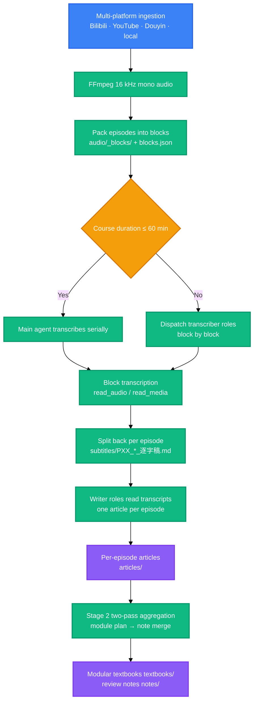

<div align="center">

<a name="readme-top"></a>

<h1>Video2Book</h1>

<p>
  <strong>Turn Bilibili, YouTube and Douyin long videos, plus local course media, into per-episode deep-dive textbooks, compiled modular books and mindmap review notes.</strong>
  <br />
  <em>Two-stage pipeline · Dual listening channels · Three deliverable tracks · Pre-delivery machine gates · Python 3.10+ · Unified multi-platform media engine</em>
</p>

<p>
  <a href="#quick-start"></a>
  <a href="LICENSE"></a>
</p>

<p>
  <a href="https://www.python.org/"></a>
  <a href="https://ffmpeg.org/"></a>
</p>

<p>
  <a href="https://modelcontextprotocol.io/"></a>
  <a href="https://docs.anthropic.com/en/docs/claude-code"></a>
  <a href="https://openai.com/codex/"></a>
  <a href="https://opencode.ai/"></a>
</p>

<p>
  <a href="README.md">简体中文</a> ·
  <strong>English</strong>
</p>

</div>

Give it a course URL or a directory, and it packs the audio into blocks, transcribes each block, splits the transcript back per episode, writes one article per episode, then consolidates them into books and review notes.

> [!CAUTION]
> This tool batch-fetches Bilibili video metadata and audio streams, and can store your login credential. Use it only on content you are entitled to access, and comply with Bilibili's terms of service and applicable law. `SESSDATA` grants access to your account: do not copy, upload or share it.

## Table of Contents

- [Overview](#overview)
- [Preview](#preview)
- [Quick Start](#quick-start)
- [How It Works](#how-it-works)
- [Usage](#usage)
- [Requirements](#requirements)
- [Configuration](#configuration)
- [Project Structure](#project-structure)
- [Commands](#commands)
- [Tech Stack](#tech-stack)
- [FAQ](#faq)
- [Security](#security)
- [License](#license)

## Overview

Video2Book is a skill for AI coding assistants that turns a course into a textbook. It accepts a Bilibili collection, a YouTube channel or playlist, a Douyin collection or a local course directory, writes one deep-dive article per episode, and consolidates those articles into a modular book and mindmap review notes.

The hard part of a long course is that you cannot finish listening to it, let alone remember it. This skill packs the audio into blocks along **episode boundaries** (an episode is never split across blocks), has a listening channel transcribe each block, then **mechanically splits** it back into one transcript per episode. Writer roles read the transcript and write the article — they never touch audio. The number of audio-reading calls therefore drops from "one per episode" to "one per block" (measured: 936 episodes of 9 courses → 381 blocks, a 2.46× reduction).

Output comes in three tracks, each in its own directory and usable on its own: per-episode articles, compiled modular textbooks, and cross-module review notes. Every deliverable passes a machine gate before delivery — filler prose, hollow headings and per-episode flat headings get caught by scripts rather than by you while reading.

The only thing you must provide is a listening channel, delivered by the companion repository [omni-media][link-omni-media]: use its `mcp/` (`read_audio`, zero credentials) when the host has a native audio modality, or its `mcp-ext/` (`read_media`, delegated to an external model) when the host is text-only. This channel is a required part of the workflow; without it Stage 1 cannot obtain audio facts and the pipeline stops to ask you to mount one. Once installed, one command runs an entire course.

<div align="right">

[![Back to top][badge-top]](#readme-top)

</div>

## Preview

The three deliverable tracks land in separate directories and never overwrite each other:

```text
output/<course_workspace>/
├── articles/      PXX_<title>_精读文章.md     # per-episode deep-dive article
├── textbooks/     模块XX_<theme>_精读全书.md   # compiled modular textbook
├── notes/         笔记XX_<theme>_笔记.md       # cross-module review note
├── audio/         PXX_*.m4a                  # 16 kHz mono audio slices
├── parts.json                               # episode topology (Stage 2 numbering basis)
└── manifest.json                            # ledger (rebuildable from disk via sync)
```

A review note opens with a knowledge topology tree — first line carries the theme and episode range, and leaf annotations align in one column (excerpt from a real artifact):

```text
Python 入门路线、开发环境搭建与基础语法体系（P01-P13）
├── AI 时代的 Python 学习路线与职业前景 (P01)
│   ├── AI 岗位爆发与政策依据 ────         纵览
│   └── 六阶段课程主线与四块实战方向 ────   纵览
└── Python 语言本体：出身、定位与应用领域 (P02)
    ├── 作者、发布年份与名字由来 ────       纵览
    └── 人类语言与编程语言的对比 ────       纵览
```

The default reading environment for all three tracks is Typora, with VS Code Markmap, XMind import and plain-text viewing also supported. Inline math requires "Inline Math" to be enabled under Typora's Preferences → Markdown, otherwise `$…$` renders as raw source.

**Real artifacts**: the companion repository [video2book-courses][link-courses] archives the complete output of four courses (Zhejiang University Software Engineering, Database System Concepts, two Full-stack AI courses) run through the full pipeline — 385 per-episode articles, 57 modular textbooks, 19 review notes and 311 transcripts. Read there first if you want to judge the output quality before installing.

<div align="right">

[![Back to top][badge-top]](#readme-top)

</div>

## Quick Start

### Prerequisites

```bash
python --version   # 3.10 or later
ffmpeg -version    # on PATH
```

### Install

> [!IMPORTANT]
> Step 3, the listening channel, cannot be skipped. Both services come from the companion repository [omni-media][link-omni-media]; pick one. Without it, Stage 1 cannot obtain audio facts and the pipeline stops to ask you to mount one.

```bash
# 1) The skill itself: copy this one directory
cp -r skills/video2book ~/.claude/skills/            # Claude Code
cp -r skills/video2book ~/.codex/skills/             # Codex
cp -r skills/video2book ~/.config/opencode/skills/   # OpenCode

# 2) Optional: install the CLI (then `video2book` replaces `python src/cli.py`)
pip install -e .

# 3) Listening channel (required): both services live in the omni-media repo
cd .. && git clone https://github.com/LINJIANG12/omni-media.git

#    Channel A: host has a native audio modality (read_audio in its tool list), zero credentials
cd omni-media/mcp && pip install -e .
omni-media status                    # diagnose system deps, host mounts and real config paths
omni-media apply --target codex      # mount to the host; valid values come from live `status` output

#    Channel B: host is text-only (only read_media) — use this instead
cd ../mcp-ext && pip install -e .
omni-media-ext config --init         # generate config.json, fill in endpoint and api_key
omni-media-ext status
omni-media-ext apply --target codex
```

### Run

Run inside the skill directory (the one holding `SKILL.md`); `--article-type` is required:

```bash
python src/cli.py pipeline "https://www.bilibili.com/video/BV14VqVBrEhc" --all --article-type learning
```

Deliverables land in `<products_root>/<course_workspace>/`: articles in `articles/`, modular textbooks in `textbooks/`, notes in `notes/`.

<div align="right">

[![Back to top][badge-top]](#readme-top)

</div>

## How It Works



- **Audio is read only by the transcriber roles, and block by block**: audio is packed into blocks along **episode boundaries** (`audio/_blocks/`, configurable target, 60 min by default; an episode is never split across blocks). A block is transcribed in one pass with line-leading timestamps, then the toolchain **mechanically splits** it back into per-episode transcripts. Writer roles read transcripts only and never touch audio.
- **Dispatch thresholds live in `src/core/budget.py`**: under 60 minutes total the main agent handles work serially; over 60 minutes it must dispatch — two transcriber roles consuming the block queue, plus writer roles picking up blocks (one sub-agent per block, writing its episodes in order). The window fallback applies only to transcriber roles on Channel A: a block whose computed audio tokens exceed 60% of the context window must be read in continuation chunks.
- **Stage 2 runs in two passes and never stalls on imperfect plans**: the first pass splits episodes into knowledge modules (`topic_plan.json`, feeding textbooks); the second merges modules into a number of notes (`note_plan.json`, one note may span several modules). Out-of-range, missing or duplicate entries are rescued in place (trimmed, filled, first-come-wins), the command always exits normally, and on-disk plan files are never overwritten by fallback results.
- **Stage 1 and Stage 2 are decoupled by content boundaries**, so a long course can resume from a breakpoint.
- **The tool layer only prepares task files, dispatch payloads and gates**; writing the articles and notes is done by the host agent (usually sub-agents). "Who wrote it" and "did it really listen" are discipline clauses the tool layer cannot verify.

<div align="right">

[![Back to top][badge-top]](#readme-top)

</div>

## Usage

### Process an entire course

```bash
# Bilibili collection
python src/cli.py pipeline "https://www.bilibili.com/video/BV14VqVBrEhc" --all --article-type learning

# Legacy Bilibili collections where every episode is its own BV (any entry auto-expands the season)
python src/cli.py pipeline "https://space.bilibili.com/87476569/lists/695667?type=season" --all --article-type learning
python src/cli.py pipeline "https://www.bilibili.com/list/87476569?sid=695667&type=season" --all --article-type learning
python src/cli.py pipeline "https://www.bilibili.com/video/BV1RV4y1T7jf" --all --article-type learning

# Local course directory
python src/cli.py pipeline "D:\courses\software_engineering\" --all --article-type learning

# YouTube single video / channel
python src/cli.py pipeline "https://www.youtube.com/@freecodecamp" --all --article-type learning

# Douyin single video / creator collection
python src/cli.py pipeline "https://www.douyin.com/user/MS4wLjAB..." --all --article-type learning
```

### Process specific episodes or a range

```bash
python src/cli.py pipeline "https://www.bilibili.com/video/BV14VqVBrEhc" --page 1 --article-type learning
python src/cli.py pipeline "https://www.bilibili.com/video/BV14VqVBrEhc" --range 2-5 --article-type learning
```

### Inspect the dispatch queue and stage gate

```bash
python scripts/queue_tracker.py --next 5 --log-dispatch --json   # dispatch payloads (task file / slices / target / budget)
python scripts/queue_tracker.py --summary                        # one-line status incl. STAGE1_DONE
python scripts/queue_tracker.py --pattern "keyword" --next 5     # pick a workspace when several coexist
```

### Generate modular textbooks and review notes

```bash
python src/cli.py cluster-articles "https://www.bilibili.com/video/BV14VqVBrEhc"           # modular book
python src/cli.py cluster-notes "https://www.bilibili.com/video/BV14VqVBrEhc"              # two-pass aggregation → note task files
python src/cli.py cluster-notes "https://www.bilibili.com/video/BV14VqVBrEhc" --force-plan # re-generate both plans
```

### Quality checks and reconciliation

```bash
python scripts/note_quality_check.py --strict      # note quality
python scripts/render_compat_check.py --strict     # rendering compliance
python src/cli.py cleanup --dry-run                # dry-run task-file reclamation
python src/cli.py sync                             # reconcile manifest.json from disk
```

Five note-quality checks are fatal and fail the delivery outright: **boilerplate filler, hollow headings, per-episode headings, inline quote fragments and episode voice**. Sentence truncation and missing structure are advisory; add `--require-structure` to gate on them. Rendering fatals are GitHub alert blocks, bare ASCII art outside fences and fence pairing; a missing fence **language tag** is advisory unless you pass `--require-lang`.

<div align="right">

[![Back to top][badge-top]](#readme-top)

</div>

## Requirements

- **Python** — 3.10 or later, from `requires-python` in `pyproject.toml`
- **Python dependencies** — `yt-dlp >= 2024.0.0`, `requests >= 2.28.0`, see `pyproject.toml`
- **External program** — `ffmpeg`, on `PATH`, a hard prerequisite for audio extraction and slicing; `ffprobe` is optional (falls back to `ffmpeg -i` for duration parsing)
- **Listening channel** — either `read_audio` or `read_media`, provided by the companion repository [omni-media][link-omni-media]
- **Operating system** — OS-independent, see the classifiers in `pyproject.toml`

<div align="right">

[![Back to top][badge-top]](#readme-top)

</div>

## Configuration

### Environment variables

| Variable | Description | Default | Required |
|---|---|---|---|
| `BVB_OUTPUT_DIR` | Products root | **`<working_dir>/output` by default**; `<container_root>/output` when working inside that container | No |
| `BVB_HOME` | Container root, the common parent of `skill/`, `omni-media/` and `output/` | Located via the `.bvb-home` marker; **absent when there is no marker — and that does not affect usability** | No |
| `BVB_AUDIO_TOKENS_PER_SEC` | Audio token factor; set around `100` for the OpenAI input_audio scale | `32` | No |
| `BVB_CONTEXT_WINDOW_TOKENS` | Context window budget | `1000000` | No |
| `OMNI_MEDIA_MCP_DIR` | Override for the native listening service directory | `<container_root>/omni-media/mcp` | No |
| `BVB_DEBUG` | Set to `1` to re-raise stack traces verbatim | unset | No |

Environment variables must be set before the process starts. A single run can also switch the products root with `--base-dir <path>`; command-line arguments take precedence over environment variables.

> **The container root is optional.** With nothing configured, products land in `output/` under **the working directory you run commands from** — install it anywhere and work there.
> Only when a container marker exists (a `.bvb-home` in an ancestor directory, or `BVB_HOME`) **and you are working inside that container** does the products root become `<container_root>/output`.
> The listening channel needs no configuration either: the agent decides between `read_audio` and `read_media` from its own tool list at use time, wherever the MCP service is installed.

### Credentials

When processing Bilibili collections, providing `SESSDATA` is recommended for stable concurrent fetching and to avoid 412 rate limiting. To obtain it: log in at bilibili.com → `F12` → Application → Cookies → `https://www.bilibili.com` → copy the `SESSDATA` value.

```bash
python src/cli.py login --sessdata "<SESSDATA>"   # persist (required argument, not interactive)
python src/cli.py info                            # show credential source and masked fingerprint
python src/cli.py logout                          # revoke the stored copy
```

The command-line `--sessdata` always takes precedence over the local store. Local media and non-Bilibili tasks skip this automatically.

<div align="right">

[![Back to top][badge-top]](#readme-top)

</div>

## Project Structure

```
skill/
├── skills/video2book/          # the skill itself; this is the only directory you install
│   ├── SKILL.md                # skill contract, the single source of truth for the Agent
│   ├── src/                    # toolchain
│   │   ├── cli.py              # entry point: 12 subcommands
│   │   ├── core/               # paths, audio budget, pipeline, fetching, deliverable lint
│   │   │   └── ingestion/      # unified media engine (Bilibili / local / YouTube / Douyin)
│   │   └── generator/          # task files, prompt templates and semantic aggregation
│   ├── scripts/                # quality checks, cleanup, queue tracking, selfcheck, runner
│   └── references/             # install guide, delivery matrix, CLI cookbook, host tool maps
├── agents/                     # skill metadata for the generic agents side
├── .claude-plugin/             # Claude Code plugin manifest
├── .codex-plugin/              # Codex plugin manifest
├── .opencode/                  # OpenCode install notes
├── AGENTS.md / CLAUDE.md       # repository-level entry notes auto-loaded per platform
└── pyproject.toml              # package metadata and CLI entry points
```

Three domains are kept isolated: the code root (this repository), the container `home` root (**optional**), and the products root.
By default the products root is `output/` under **the working directory**; when you work inside that container it is `<container_root>/output` — either way it stays out of the code directory. If you install the skill inside a git repository and do not want products committed, add `output/` to that repository's `.gitignore`.

<div align="right">

[![Back to top][badge-top]](#readme-top)

</div>

## Commands

Three equivalent entry points with identical behaviour:

- Repository-preferred: `python src/cli.py <subcommand>`
- No-install script: `python scripts/run.py <subcommand>`
- System command: `video2book <subcommand>` (available after `pip install -e .`)

### Subcommands

| Command | Description | Example |
|---|---|---|
| `parse` | Parse video topology and list episodes | `python src/cli.py parse "<url>" --limit 10` |
| `audio` | Download or extract the audio stream | `python src/cli.py audio "<url>" --all` |
| `transcribe` | Export a per-episode article task file, no intermediate transcript | `python src/cli.py transcribe "<url>" --page 1 --article-type learning` |
| `pipeline` | Run the complete pipeline | `python src/cli.py pipeline "<url>" --all --article-type learning` |
| `cluster-articles` | Consolidate per-episode articles into modular textbooks | `python src/cli.py cluster-articles "<url>"` |
| `cluster-notes` | Two-pass semantic aggregation, export note task files | `python src/cli.py cluster-notes "<url>"` |
| `dedup` | Synchronize duplicate audio assets to save tokens | `python src/cli.py dedup --dry-run` |
| `cleanup` | Reclaim completed task files, keeping samples | `python src/cli.py cleanup --dry-run` |
| `sync` | Reconcile manifest.json from on-disk products | `python src/cli.py sync --dry-run` |
| `info` | Show environment and toolchain readiness | `python src/cli.py info` |
| `login` | Persist the Bilibili SESSDATA | `python src/cli.py login --sessdata "<SESSDATA>"` |
| `logout` | Remove the stored SESSDATA | `python src/cli.py logout` |

### Key arguments

| Argument | Applies to | Description | Default |
|---|---|---|---|
| `--article-type` | `pipeline` / `transcribe` | Prompt style: `learning` (recommended) / `legacy` | missing ⇒ exit code 4 |
| `--all` / `--range X-Y` / `--page N` | `pipeline` / `audio` | Scope: all / a range / one episode | single episode |
| `--force` | most commands | Force re-run, ignoring existing products | off |
| `--base-dir` | all | Products root path | `BVB_OUTPUT_DIR`, or `<working_dir>/output` by default (`<container_root>/output` when working inside that container) |
| `--task` | all | Workspace directory name | the most recently active one |
| `--sessdata` | all | Credential for this run, overrides the local store | stored copy |
| `--dry-run` | `dedup` / `cleanup` / `sync` | Report only, write nothing | off |
| `--force-plan` | `cluster-notes` | Re-generate both semantic plans | off |
| `--kernel-index` | `cluster-notes` | Optional: inject historical knowledge kernels as a locating index | off |
| `--json` | `parse` / `audio` / scripts | JSON output | off |

### Quality and operations scripts

| Script | Description | Common arguments |
|---|---|---|
| `scripts/queue_tracker.py` | Pending episodes, stage gate, dispatch payload and ledger | `--next N` / `--summary` / `--pattern` / `--log-dispatch` / `--json` |
| `scripts/note_quality_check.py` | Note quality check | `--strict`, `--require-structure`, `--max-truncated N` |
| `scripts/render_compat_check.py` | Rendering compliance check | `--strict`, `--require-lang` |
| `scripts/selfcheck.py` | The repository's single gate selfcheck | — |
| `scripts/run.py` | No-install CLI entry point | passes subcommands through |

### Exit codes

- `0` — normal completion
- `4` — article prompt style not confirmed, i.e. `--article-type` missing or invalid

<div align="right">

[![Back to top][badge-top]](#readme-top)

</div>

## Tech Stack

### Runtime

- **Python 3.10 or later** — the only runtime, standard library only
- **setuptools** — build backend, see `pyproject.toml`

### External dependencies

- **FFmpeg** — audio extraction and slicing, 16 kHz mono

### Ingestion and listening

- **Multi-platform media engine** — `src/core/ingestion/`, registering unified providers for Bilibili / local / YouTube / Douyin behind an `IngestionCoordinator`
- **MCP** — the protocol used by the host's native listening path (`read_audio` / `read_media`)

<div align="right">

[![Back to top][badge-top]](#readme-top)

</div>

## FAQ

### Can I use it without omni-media?

No. Both listening channels, `read_audio` and `read_media`, come from [omni-media][link-omni-media], and the workflow treats one as mandatory: when Stage 1 cannot obtain audio facts, the pipeline stops to ask you to mount one.

### Should I install mcp or mcp-ext?

It depends on the host's modality. If `read_audio` is in your tool list, the host has a native audio modality — install `mcp/`, lowest latency and zero credentials. If only `read_media` is present, the host is text-only — install `mcp-ext/`, which names an external model endpoint in `config.json`. Both channels share the same pagination contract, so switching is a matter of changing the tool name.

### The listening channel is installed but no transcript comes back

First check which layer the error came from. If the tool reports that the error came from the endpoint's **upstream**, the MCP service and the gateway process are both fine — the gateway itself cannot obtain upstream credentials, or the upstream is unreachable. `omni-media-ext status --probe` **cannot detect this**, because it only issues `GET /models`. Check that your local proxy/accelerator is running and can reach the upstream, and do **not** change endpoint settings such as `/audio/transcriptions` or `model` — rerunning will not help either.

If instead the error says the transcription endpoint returned the model's own outline/plan N times in a row, that is an occasional upstream-model behaviour: the service already re-reads within `max_retries`. If it still fails, retry the slice or re-read it with a smaller `duration_minutes`.

### Why is --article-type mandatory?

The article style is confirmed by the user. Two prompts are provided: `learning` (recommended) and `legacy`. Four further shapes — consulting, interview, review and livestream — are registered but have no prompts. When the type is missing, unspellable, or maps to a shape without a prompt, the command prints the style menu and exits with code 4, writing no task file.

### Will an imperfect Stage 2 plan stall the pipeline?

No. Neither pass stalls: out-of-range blocks are trimmed, unclaimed episode numbers are filled as placeholders, and a fallback granularity keeps things moving — the command always exits normally, and on-disk `topic_plan.json` / `note_plan.json` are never overwritten by fallback results. Re-running after filling in the plan replaces them automatically.

### How do I confirm channels and products?

`python src/cli.py info` prints the readiness of Python / ffmpeg / ffprobe, both listening channels and the three domain paths. `omni-media status` diagnoses system dependencies, host mounts and real config paths. `python scripts/queue_tracker.py --summary` reports Stage 1 completeness and dispatch advice.

### Do credentials end up in version control?

No. This repository excludes the Bilibili `SESSDATA`, and omni-media excludes the `mcp-ext` `config.json`, committing only the template. Channel A needs no credentials at all.

<div align="right">

[![Back to top][badge-top]](#readme-top)

</div>

## Security

- Credential storage: `login` writes the Bilibili `SESSDATA` **in plaintext** to `.sessdata.json` under the products root, a path already excluded by ignore rules, so it does not enter version control.
- Revocation: if you suspect a leak, log out of Bilibili to invalidate the value, then run `logout` to clear the local copy.
- Access scope: the tool only reads public Bilibili video metadata and audio streams, plus the local media files you point it at.
- Reporting: this repository has no `SECURITY.md` yet; report security issues via a repository issue.

<div align="right">

[![Back to top][badge-top]](#readme-top)

</div>

## License

[MIT](LICENSE)

<div align="right">

[![Back to top][badge-top]](#readme-top)

</div>

<!-- LINKS & IMAGES -->

[badge-top]: https://img.shields.io/badge/-Back_to_top-151515?style=flat-square
[link-omni-media]: https://github.com/LINJIANG12/omni-media
[link-courses]: https://github.com/LINJIANG12/video2book-courses
