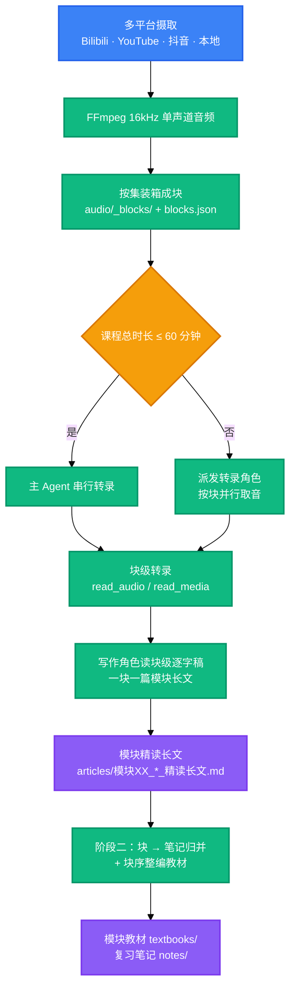

<div align="center">

<a name="readme-top"></a>

<h1>Video2Book</h1>

<p>
  <strong>把 B 站、YouTube、抖音长视频与本地课程音视频，按块听音直出精读教材长文，再整编为模块全书与思维导图复习笔记。</strong>
  <br />
  <em>两阶段流水线 · 双通道听音 · 三轨交付 · 交付前机器门禁 · Python 3.10+ · 多平台统一媒体内核</em>
</p>

<p>
  <a href="#快速开始"></a>
  <a href="LICENSE"></a>
</p>

<p>
  <a href="https://www.python.org/"></a>
  <a href="https://ffmpeg.org/"></a>
</p>

<p>
  <a href="https://modelcontextprotocol.io/"></a>
  <a href="https://docs.anthropic.com/en/docs/claude-code"></a>
  <a href="https://openai.com/codex/"></a>
  <a href="https://opencode.ai/"></a>
</p>

<p>
  <strong>简体中文</strong> ·
  <a href="README.en.md">English</a>
</p>

</div>

给出一门课的链接或目录，它把音频装箱成 40–60 分钟的块、按块转录后**一块成一篇**模块长文，再按块序整编出模块教材与复习笔记。

> [!CAUTION]
> 本工具会批量抓取 B 站视频的元数据与音频流，并可保存你的登录凭证。仅用于你自己有权访问的内容，遵守 B 站的服务条款与相关法律规定。`SESSDATA` 等同账号登录态，不要复制、上传或分享。

## 目录

- [项目概述](#项目概述)
- [效果预览](#效果预览)
- [快速开始](#快速开始)
- [工作原理](#工作原理)
- [使用方法](#使用方法)
- [运行环境与依赖](#运行环境与依赖)
- [配置](#配置)
- [项目结构](#项目结构)
- [命令](#命令)
- [技术栈](#技术栈)
- [常见问题](#常见问题)
- [安全](#安全)
- [许可证](#许可证)

## 项目概述

Video2Book 是一个面向 AI 编程助手的技能，用来把一门课写成教材。它接受 B 站合集、YouTube 频道/播放列表、抖音合集或本地课程目录，一块产出**一篇**模块精读长文（块覆盖连续的几集），再把各块长文整编为模块教材与思维导图复习笔记。

长课程的直接难点是听不完、也记不住。这个技能把音频按集边界装箱成 40–60 分钟的块（超长集劈上下），交给听音通道把整块转成逐字稿；写作角色读块级逐字稿，一块写一篇模块长文，不再接触音频。按集切分只是事后查阅的可选动作，不在主链上。取音调用次数因此从「每集一次」降到「每块一次」（实测 9 门课 936 集 → 381 块，降 2.46 倍）。

产出分三轨，各自落在独立目录，可以单独取用：模块精读长文、模块合辑教材、跨块复习笔记。每个产物在交付前都要过一遍机器门禁——套话填充、空壳标题、分集平铺标题这类问题会被脚本拦下，而不是留给你在阅读时发现。

你需要准备的只有一个听音通道，它由配套仓库 [omni-media][link-omni-media] 提供：宿主自带音频模态时用它的 `mcp/`（`read_audio`，零凭证），只有文本能力时用它的 `mcp-ext/`（`read_media`，由外部模型代读）。这个通道是工作流的必需环节，缺了它阶段一取不到音频事实，流水线会停下提示你挂载。装好之后，一条命令就能跑完一门课。

<div align="right">

[![返回顶部][badge-top]](#readme-top)

</div>

## 效果预览

三类产物分目录落盘，互不覆盖：

```text
output/<课程工作区>/
├── articles/      模块XX_<块标题>_精读长文.md  # 模块精读长文（一个块一篇）
├── textbooks/     模块01_<册名>_精读全书.md      # 教材（册=书、章=块，册名取自内容）
├── notes/         笔记XX_<主题>_笔记.md       # 跨模块聚合的复习笔记
├── audio/         PXX_*.m4a                 # 16kHz 单声道音频切片
├── parts.json                               # 工作区集号拓扑（阶段二取集号基准）
└── manifest.json                            # 账本（可由 sync 按磁盘回填）
```

复习笔记开头的知识拓扑树长这样——首行写主题与分集范围，末级注释纵向对齐同一列（下为真实产物节选）：

```text
Python 入门路线、开发环境搭建与基础语法体系（P01-P13）
├── AI 时代的 Python 学习路线与职业前景 (P01)
│   ├── AI 岗位爆发与政策依据 ────         纵览
│   └── 六阶段课程主线与四块实战方向 ────   纵览
└── Python 语言本体：出身、定位与应用领域 (P02)
    ├── 作者、发布年份与名字由来 ────       纵览
    └── 人类语言与编程语言的对比 ────       纵览
```

三类产物的默认阅读场景是 Typora，同时兼顾 VS Code Markmap、XMind 导入与纯文本查看。行内公式需在 Typora 的「偏好设置 → Markdown」里勾选「内联公式」，否则会原样显示 `$…$` 源码。

**真实产物示例**：配套仓库 [video2book-courses][link-courses] 归档了四门课程（浙大软件工程、数据库系统概论、黑马 NLP、黑马 Python+AI）跑完整流水线后的全部交付物——385 篇单集长文、57 本模块合辑全书、19 篇复习笔记与 311 份逐字稿。想先看输出质量再决定是否安装，可以直接从那里读起。

<div align="right">

[![返回顶部][badge-top]](#readme-top)

</div>

## 快速开始

### 前置条件

```bash
python --version   # 3.10 及以上
ffmpeg -version    # 已加入 PATH
```

### 安装

> [!IMPORTANT]
> 第三步的听音通道不可跳过。两个服务都来自配套仓库 [omni-media][link-omni-media]，二选一即可；没有它，阶段一取不到音频事实，流水线会停下提示你挂载。

```bash
# 1) 技能本体：复制这一个目录即可
cp -r skills/video2book ~/.claude/skills/            # Claude Code
cp -r skills/video2book ~/.codex/skills/             # Codex
cp -r skills/video2book ~/.config/opencode/skills/   # OpenCode

# 2) 可选：安装 CLI（装完可用 video2book 命令替代 python src/cli.py）
pip install -e .

# 3) 听音通道（必需）：两个服务同属配套仓库 omni-media
cd .. && git clone https://github.com/LINJIANG12/omni-media.git

#    通道 A：宿主有原生音频模态（工具列表里有 read_audio），零凭证
cd omni-media/mcp && pip install -e .
omni-media status                    # 诊断系统依赖、各宿主挂载状态与实际配置路径
omni-media apply --target codex      # 挂到宿主；可用取值以 status 的实际输出为准

#    通道 B：宿主只有文本能力（只有 read_media）时改用它
cd ../mcp-ext && pip install -e .
omni-media-ext config --init         # 生成 config.json，填入端点与 api_key
omni-media-ext status
omni-media-ext apply --target codex
```

### 运行

在技能目录（`SKILL.md` 所在目录）下执行，`--article-type` 必填：

```bash
python src/cli.py pipeline "https://www.bilibili.com/video/BV14VqVBrEhc" --all --article-type learning
```

产物落在 `<产物根>/<课程工作区>/`：长文在 `articles/`，模块教材在 `textbooks/`，笔记在 `notes/`。

<div align="right">

[![返回顶部][badge-top]](#readme-top)

</div>

## 工作原理



- **取音只发生在转录角色身上，且按块取**：音频按集边界装箱成 40–60 分钟的块（`audio/_blocks/`，目标时长默认 50 分钟；超长集劈上/下两条腿分块转录），块标题由块内分集名语义组合而来、写进块音频文件名。转录角色一次读完整块产出高保真纯文本块级逐字稿；写作角色只读逐字稿，一个块写一篇模块长文，不再接触音频。
- **派发阈值写在 `src/core/budget.py`**：课程总时长在 60 分钟以内时由主 Agent 串行处理，超过则必须派发——转录角色建议 2 个并行消费块队列，写作角色**一个块一个子智能体**（一块一篇模块长文）。窗口兜底只对**走通道 A 的转录角色**成立：实算音频 token 超过上下文窗口 60% 的块必须分卷续读。
- **模块层没有规划，只有归并一趟，且缺归并不停机**：块就是知识模块（音频按 40–60 分钟装箱，块标题由块内分集名语义组合而来），教材直接按块序整编块长文；笔记侧把块归并成若干篇（`note_plan.json`，一篇可跨多个块）。漏认领／重复认领／引用不存在的块都当场抢救，命令始终正常退出，盘上的 `note_plan.json` 不会被兜底结果覆盖。
- **阶段一与阶段二按内容边界解耦**，较长课程也能在断点后续跑。
- **工具层只产出任务书、派发载荷与门禁**，长文与笔记的撰写由宿主 Agent（通常为子智能体）完成；「谁写的」「是否真听了音频」属纪律条款，工具层无法校验。

<div align="right">

[![返回顶部][badge-top]](#readme-top)

</div>

## 使用方法

最小可用示例（**在技能目录下执行**，`--article-type` 必填）：

```bash
# 处理整门 B 站网课合集
python src/cli.py pipeline "https://www.bilibili.com/video/BV14VqVBrEhc" --all --article-type learning

# 处理本地课程目录
python src/cli.py pipeline "D:\courses\software_engineering" --all --article-type learning
```

其余用法按需查 [CLI 场景手册](skills/video2book/references/cli-cookbook.md)（CLI 细节的单一真源）：

- **按平台 / 按区间取音**：B 站合集与「每个分集都是独立 BV」的旧版合集、YouTube 频道、抖音博主合集、`--page` / `--range` 选集；
- **派发队列与阶段门禁**：`queue_tracker.py` 的转录侧 / 写作侧 / 笔记侧取载荷与单行状态；
- **生成教材与笔记**：`cluster-articles` / `cluster-notes`（含 `--force` 重编）；
- **质检与收尾**：`check` 统一门禁（`--stage1` 放行 / `--deliver` 体检 / `--fix-numbering` 标题去号）、`cleanup` 与 `sync`（已由主流程自动执行）。

笔记成色的五类致命项为**套话填充、空壳标题、分集平铺标题、行内残缺引用、分集口吻**，命中即判失败；断句与结构缺件属提示项，加 `--require-structure` 才纳入门禁。渲染合规的致命项为 GitHub 告警块、围栏外裸字符画与围栏配对；**围栏语言标识**默认只提示，加 `--require-lang` 才纳入门禁。

<div align="right">

[![返回顶部][badge-top]](#readme-top)

</div>

## 运行环境与依赖

- **Python** — 3.10 及以上，取自 `pyproject.toml` 的 `requires-python`
- **Python 依赖** — `yt-dlp >= 2024.0.0`、`requests >= 2.28.0`，见 `pyproject.toml`
- **外部程序** — `ffmpeg`，需加入 `PATH`，是取音频/切片的硬前置；`ffprobe` 可选（缺失时改用 `ffmpeg -i` 解析时长）
- **听音通道** — `read_audio` 或 `read_media`，二者其一，由配套仓库 [omni-media][link-omni-media] 提供
- **操作系统** — 与操作系统无关，见 `pyproject.toml` 的分类器

<div align="right">

[![返回顶部][badge-top]](#readme-top)

</div>

## 配置

### 环境变量

| 变量 | 说明 | 默认 | 必需 |
|---|---|---|---|
| `BVB_OUTPUT_DIR` | 产物根 | **默认 `<工作目录>/output`**；在当前容器内工作时为 `<容器根>/output` | 否 |
| `BVB_HOME` | 容器根，`skill/`、`omni-media/`、`output/` 的共同父目录 | 由 `.bvb-home` 标记定位；**没有标记时不存在，也不影响可用性** | 否 |
| `BVB_AUDIO_TOKENS_PER_SEC` | 音频 token 系数；OpenAI input_audio 口径约设 `100` | `32` | 否 |
| `BVB_CONTEXT_WINDOW_TOKENS` | 上下文窗口预算 | `1000000` | 否 |
| `OMNI_MEDIA_MCP_DIR` | 原生听音服务目录的覆盖 | `<容器根>/omni-media/mcp` | 否 |
| `BVB_DEBUG` | 设为 `1` 时原样抛出栈回溯 | 未设置 | 否 |

环境变量需在进程启动前设置。单次执行也可用 `--base-dir <路径>` 换产物根，命令行参数优先于环境变量。

> **容器根是可选的。** 不设任何变量时，产物落在**你执行命令时的工作目录**下的 `output/`——装到哪儿就能在哪儿干活。
> 只有容器标记存在（祖先目录里的 `.bvb-home`，或 `BVB_HOME`）**且你就在该容器内工作**时才改用 `<容器根>/output`。
> 听音通道同样不需要配置：`read_audio` / `read_media` 由 Agent 在用时按自己的工具列表判定，MCP 服务装在哪都可以。

### 凭证配置

处理 B 站合集时建议提供 `SESSDATA`，以保障高并发抓取稳定性并避免触发 412 频控。获取方式：浏览器登录 bilibili.com → `F12` → Application → Cookies → `https://www.bilibili.com` → 复制 `SESSDATA` 的值。

```bash
python src/cli.py login --sessdata "<SESSDATA>"   # 持久化（必填参数，非交互式）
python src/cli.py info                            # 查看凭证来源与脱敏指纹
python src/cli.py logout                          # 撤销保存
```

命令行 `--sessdata` 的优先级始终高于本地存档。本地音视频或非 B 站任务自动跳过此项。

<div align="right">

[![返回顶部][badge-top]](#readme-top)

</div>

## 项目结构

```
skill/
├── skills/video2book/          # 技能本体，安装时只需这一个目录
│   ├── SKILL.md                # 技能契约，Agent 的唯一事实源
│   ├── src/                    # 工具链
│   │   ├── cli.py              # 入口：10 个子命令
│   │   ├── core/               # 路径、音频预算、流水线、抓取、交付物质检
│   │   │   └── ingestion/      # 多平台统一媒体内核（B 站 / 本地 / YouTube / 抖音）
│   │   └── generator/          # 任务书、提示词模板与语义聚合
│   ├── scripts/                # 派发队列、自检与免安装入口
│   └── references/             # 安装说明、交付矩阵、CLI 场景手册、宿主工具映射
├── agents/                     # 通用 agents 侧的技能元数据
├── .claude-plugin/             # Claude Code 插件清单
├── .codex-plugin/              # Codex 插件清单
├── .opencode/                  # OpenCode 安装说明
├── AGENTS.md / CLAUDE.md       # 各平台自动加载的仓库级入口说明
└── pyproject.toml              # 包元数据与 CLI 入口
```

三域相互隔离：代码根（本仓库）、容器根 `home`（**可选**）、产物根 `products`。
默认产物根是**工作目录下的 `output/`**，在容器内工作时则是 `<容器根>/output`——
两种情况都与代码目录分离；把技能装进某个 git 仓库、又想产物不进版本库时，给那份仓库的 `.gitignore` 加上 `output/`。

<div align="right">

[![返回顶部][badge-top]](#readme-top)

</div>

## 命令

三个等价入口，功能一致：

- 仓库推荐：`python src/cli.py <子命令>`
- 免安装脚本：`python scripts/run.py <子命令>`（可任意工作目录调用）
- 系统命令：`video2book <子命令>`（`pip install -e .` 后可用）

最常见的四条示例（`--article-type` 必填，不传即退出码 4）：

```bash
python src/cli.py pipeline "https://www.bilibili.com/video/BV14VqVBrEhc" --all --article-type learning
python scripts/queue_tracker.py --next-module 5 --json    # 写作侧取载荷（含任务书/逐字稿/目标路径）
python src/cli.py cluster-notes "<链接或本地路径>"          # 块 → 笔记归并，导出笔记任务书
python src/cli.py check --deliver --strict                 # 交付前体检（笔记成色 + 渲染合规）
```

**10 个子命令的完整清单、每个开关的用途、全部参数、逐场景示例与退出码（0–4）** 集中在
[CLI 场景手册](skills/video2book/references/cli-cookbook.md)——那是 CLI 细节的单一真源，本文不再重复维护。

<div align="right">

[![返回顶部][badge-top]](#readme-top)

</div>

## 技术栈

### 运行时

- **Python 3.10 及以上** — 唯一运行时；B 站与本地两条链路只依赖标准库（`urllib`）
- **setuptools** — 构建后端，见 `pyproject.toml`

### 外部依赖

- **FFmpeg** — 音频抽取与切片，16kHz 单声道（系统程序，需在 `PATH`）
- **`yt-dlp` / `requests`** — 声明依赖，见 `pyproject.toml`；YouTube 与抖音链路按需导入（`yt_dlp` 在 `ytaudio`/`youtube`，`requests` 在 `dyaudio`），这两条链路不装就跑不通

### 摄取与听音

- **多平台媒体内核** — `src/core/ingestion/`，为 B 站 / 本地 / YouTube / 抖音注册统一 Provider，经 `IngestionCoordinator` 调度
- **MCP** — 宿主原生听音所用的协议（`read_audio` / `read_media`）

<div align="right">

[![返回顶部][badge-top]](#readme-top)

</div>

## 常见问题

### 不装 omni-media 能用吗

不能。两个听音通道 `read_audio` 与 `read_media` 都由 [omni-media][link-omni-media] 提供，工作流把它列为必需项：阶段一取不到音频事实时，流水线会停下提示你挂载其一。

### 该装 mcp 还是 mcp-ext

看宿主的模态。工具列表里有 `read_audio`，说明宿主有原生音频模态，装 `mcp/`，延迟最低且零凭证；只有 `read_media`，说明宿主仅有文本能力，装 `mcp-ext/`，由 `config.json` 指定外部模型端点。两条通道分页契约同构，切换只需换工具名。

### 听音通道装好了却取不到逐字稿

先看报错落在哪一层。若提示「这条错误来自端点的**上游**」，说明 MCP 服务与网关进程都正常，失败发生在网关的上游（拿不到上游凭证，或上游不可达）——`omni-media-ext status --probe` **测不出**这种情形，因为它只发 `GET /models`。此时按提示检查本机代理/加速器是否在运行、能否连上上游，**不要**去改 `/audio/transcriptions`、`model` 一类端点配置；重跑也不会变好。

若提示「转录端点连续 N 次返回模型自述的提纲/计划」，那是外部模型偶发把提纲当结果返回，工具已按 `max_retries` 自动重读；仍失败就重试本片，或把 `duration_minutes` 调小后重读本片。

### 为什么必须传 --article-type

长文风格由用户确认。当前提供 `learning`（学习，推荐）与 `legacy`（旧版）两种提示词；另有咨询答疑、访谈对谈、测评体验、直播闲聊四种形态只登记、未提供提示词。未指定、拼写无法命中、或命中未提供提示词的形态时，命令打印风格菜单并以退出码 4 终止，不落盘任何任务书。

### 阶段二规划写得不完美会卡住吗

不会。归并不停机：引用了不存在块的认领丢掉、重复认领先到先得、没人认领的块各补成一篇兜底笔记，命令始终正常退出，且盘上的 `note_plan.json` 不会被兜底结果覆盖，补齐后重跑即自动替换。

### 怎么确认挂载与产物状态

`python src/cli.py info` 会打印 Python / ffmpeg / ffprobe / 两条听音通道的就绪状态与三域路径；`omni-media status` 诊断系统依赖、各宿主挂载状态与实际配置路径。`python scripts/queue_tracker.py --summary` 给出阶段一完成度与派发建议。

### 凭证会进版本库吗

不会。本仓库把 B 站 `SESSDATA` 排除在外，omni-media 也把 `mcp-ext` 的 `config.json` 排除在外，只提交模板。通道 A 本身零凭证，不需要配置任何密钥。

<div align="right">

[![返回顶部][badge-top]](#readme-top)

</div>

## 安全

- 凭证存放：`login` 把 B 站 `SESSDATA` **以明文**写入产物根的 `.sessdata.json`，该路径已被忽略规则排除，不会进入版本库。
- 失效方式：怀疑泄露时到 B 站退出登录使该凭证失效，再运行 `logout` 清除本地存档。
- 访问范围：工具只读取 B 站的公开视频元数据与音频流，以及你指定的本地媒体文件。
- 上报渠道：本仓库暂无 `SECURITY.md`，安全问题请在仓库提交 issue。

<div align="right">

[![返回顶部][badge-top]](#readme-top)

</div>

## 许可证

[MIT](LICENSE)

<div align="right">

[![返回顶部][badge-top]](#readme-top)

</div>

<!-- LINKS & IMAGES -->

[badge-top]: https://img.shields.io/badge/-返回顶部-151515?style=flat-square
[link-omni-media]: https://github.com/LINJIANG12/omni-media
[link-courses]: https://github.com/LINJIANG12/video2book-courses
